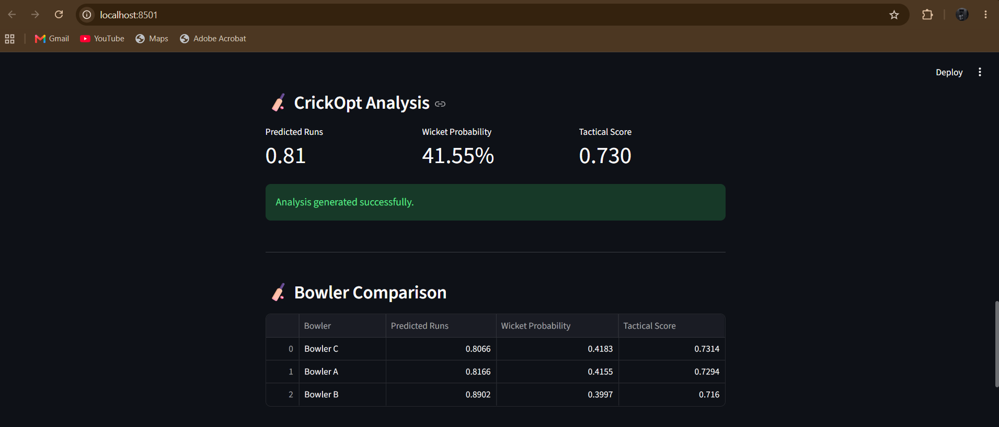
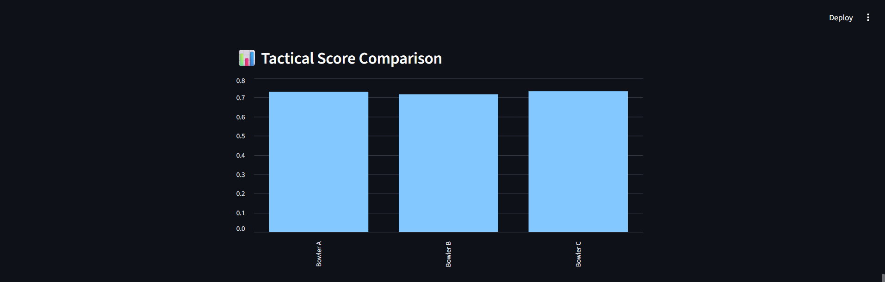
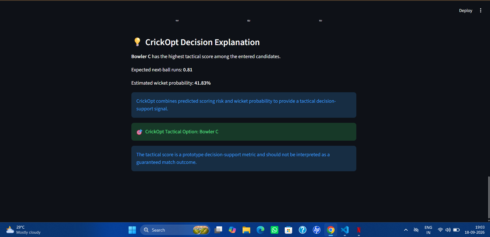

# 🏏 CrickOpt

## AI-Based Cricket Tactical Decision Optimization

CrickOpt is a machine learning-based cricket analytics and tactical decision-support system designed to analyze ODI ball-by-ball data and provide tactical insights for cricket situations.

The system estimates next-ball scoring and wicket probability and combines these predictions into a tactical score to compare bowling options.

---
## 🚀 Live Demo

👉 [Launch CrickOpt]([https://crickopt-afnyezpfwenqupwkd58vf.streamlit.app/](https://crickopt-afnyezpfwenquwpkwd58vf.streamlit.app/))
## 🎯 Problem Statement

Cricket tactical decisions depend on several factors such as:

- Current score
- Wickets lost
- Match phase
- Recent scoring momentum
- Batter performance
- Bowler performance
- Batter-bowler matchup

CrickOpt uses historical ODI ball-by-ball data and machine learning to transform these factors into a data-driven tactical decision-support signal.

---

## 🚀 Key Features

- ODI ball-by-ball data analysis
- Cricket-specific feature engineering
- Recent scoring momentum analysis
- Past-only batter and bowler statistics
- Batter-bowler matchup analysis
- Next-ball run prediction
- Next-ball wicket probability prediction
- Tactical score calculation
- Bowler comparison
- Streamlit-based interactive application

---

## 🧠 Machine Learning Approach

CrickOpt uses machine learning models to estimate two important next-ball outcomes:

### 1. Next-Ball Runs Prediction

A Random Forest Regression model estimates the expected number of runs on the next delivery.

### 2. Next-Ball Wicket Prediction

A Random Forest Classification model estimates the probability of a wicket on the next delivery.

These predictions are combined into a tactical score for comparing candidate bowling options.

---

## 📊 Features Used

The leakage-aware model uses features including:

- Innings
- Over number
- Current score
- Wickets lost
- Runs in previous 6 deliveries
- Runs in previous 12 deliveries
- Wickets in previous 12 deliveries
- Striker balls
- Batter past average
- Bowler past runs per ball
- Bowler past wicket rate
- Batter-bowler past runs per ball
- Batter-bowler past wicket rate

The player and matchup statistics are calculated using historical information available before the prediction point.

---

## 📈 Tactical Score

CrickOpt combines predicted scoring and wicket probability into a prototype tactical score.

The score is designed as a decision-support signal for comparing candidate bowling options.

> **Note:** The tactical score is a prototype metric and should not be interpreted as a guaranteed match outcome or a replacement for expert cricket decision-making.

---

## 🖥️ Streamlit Application

CrickOpt includes an interactive Streamlit application where users can enter a match situation such as:

- Innings
- Over number
- Current score
- Wickets lost
- Recent scoring rate
- Bowler performance statistics

The application generates:

- Predicted runs
- Wicket probability
- Tactical score
- Bowler comparison
- Recommended tactical option

---

## 🗂️ Project Structure

```text
CrickOpt/
│
├── data/
│   └── odis_csv2/              # Local ODI dataset (not uploaded)
│
├── models/
│   ├── crickopt_final_runs_model.pkl
│   ├── crickopt_final_wicket_model.pkl
│   ├── crickopt_player_model.pkl
│   ├── crickopt_runs_model.pkl
│   ├── crickopt_wicket_model.pkl
│   └── crickopt_tactical_recommendation.csv
│
├── notebooks/
│   └── crickopt_analysis.ipynb
│
├── src/
│   └── app.py
│
├── .gitignore
└── README.md
## 📸 Application Screenshots

### 🏏 CrickOpt Analysis Dashboard


### 🎯 Bowler Comparison


### 📊 Tactical Score Comparison


### 💡 Decision Explanation

